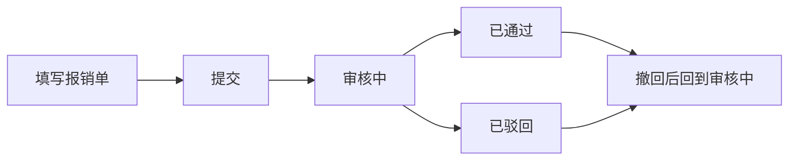

# 智能报销系统 · 报销流程说明

本文档仅说明报销业务在系统中的 **流程与状态**，不涉及登录、个人信息等其他功能。具体菜单名称以贵司系统为准；业务规则须同时遵守贵司财务及内控制度。

---

## 1. 流程总览

**文字版：** 填写报销单 → 提交 → **审核中** → **已通过** 或 **已驳回**；在允许时，「已通过」「已驳回」可经 **撤回** 再回到 **审核中**。

| 阶段 | 说明 |
|------|------|
| 填写与提交 | 申请人选择报销类型、填写表单、上传附件后提交。 |
| 审核中 | 等待审批人处理；申请人可在报销记录中查看进度与详情。 |
| 已通过 / 已驳回 | 审批人给出结论；驳回时一般需填写驳回原因。 |
| 撤回 | 在系统允许的前提下，将「已通过」或「已驳回」的单据恢复为「审核中」，便于更正或重审（谁可操作以系统按钮及单位规定为准）。 |

---

## 2. 申请人（报销人）

1. **进入「填写报销」**（或贵司菜单中的同等功能），选择 **报销类型**（类型及字段由管理员预先配置）。  
2. **填写表单**，按页面要求上传 **附件**（如发票影像、电子发票等）。若单位启用智能识别，可对附件辅助录入，**提交前须自行核对** 金额、日期等关键信息。  
3. **提交** 后，该笔单据进入 **审核中**。  
4. 在 **报销记录** 中可 **查询、查看详情、预览附件**；若被 **驳回**，请根据 **驳回原因** 与单位制度处理（如修改后重新提交等，以贵司流程为准）。  
5. 若界面提供 **撤回** 且当前状态允许，申请人可将本人已审结的单据撤回到 **审核中**（具体以系统提示为准）。

**数据范围：** 申请人通常仅能查看 **本人** 提交的报销单。

---

## 3. 审批人（具备报销审批权限的人员）

1. 在 **报销记录**（或工作台待办入口，若已配置）中查看待处理单据；列表中一般可看到 **申请人** 等信息。  
2. 对 **审核中** 的单据：  
   - **通过：** 单据变为 **已通过**。  
   - **驳回：** 须填写 **驳回原因**，单据变为 **已驳回**。  
3. 打开 **详情** 可核对表单内容、附件及系统 **超额** 等提示信息。  
4. 必要时可对 **已通过** 或 **已驳回** 的单据执行 **撤回**，使其回到 **审核中**（用于纠错或补充审核；管理员与申请人的可操作范围可能不同，以系统为准）。  
5. 可按条件 **筛选** 记录；具备导出权限时，可按单位规定 **导出** 数据用于对账或归档。

---

## 4. 状态一览

| 状态 | 含义 |
|------|------|
| 审核中 | 已提交，尚未形成最终审批结论。 |
| 已通过 | 审批同意。 |
| 已驳回 | 审批不同意；申请人应关注驳回原因并按制度跟进。 |

---

**说明：** 报销类型如何配置、是否多级审批、票据合规要求等，以贵司管理制度及系统后台配置为准；本说明仅描述上述系统内常见流转方式。
